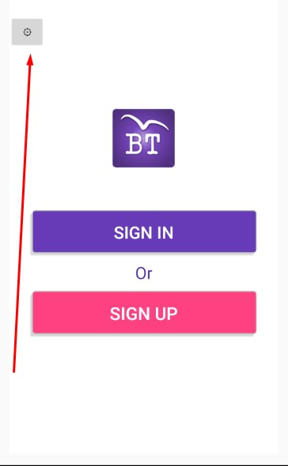

# BirdTouch-Client
## Summary
BirdTouch client is an application for Android (Jelly Bean and later), written in .Net (Xamarin).

In order for app to work correctly, you'll need [BirdTouchWebAPI server](https://github.com/ilic5000/BirdTouch-WebAPI) up an running.

## Configuration
If endpoints, protocol or ip address of the WebAPI server changes, you'll need to go to login setting page, that can be accessed by clicking on gear icon on the welcome screen, and put the correct values.

Note: If you are already logged in, then you must either sign-out or clear cache for the app in Android Settings in order to get to the welcome screen. 

## Debug mode

Long hold "Settings" title on a settings page.
- Set unlimited radius
- More to come